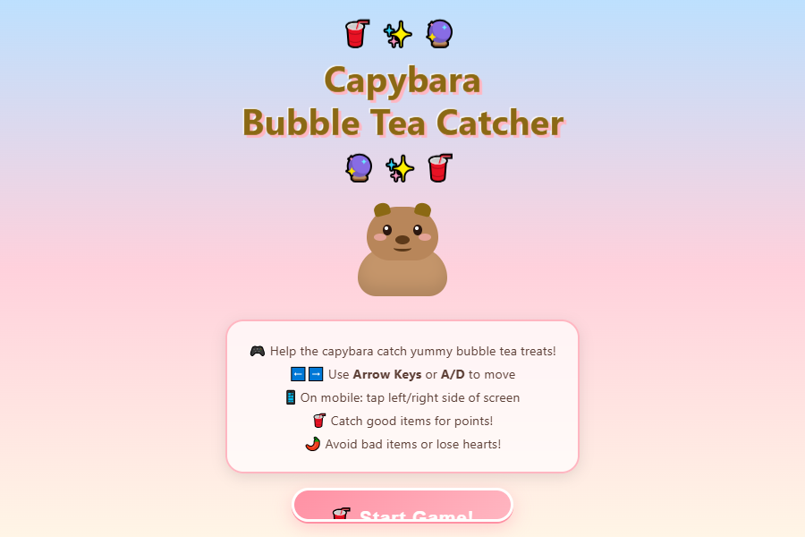
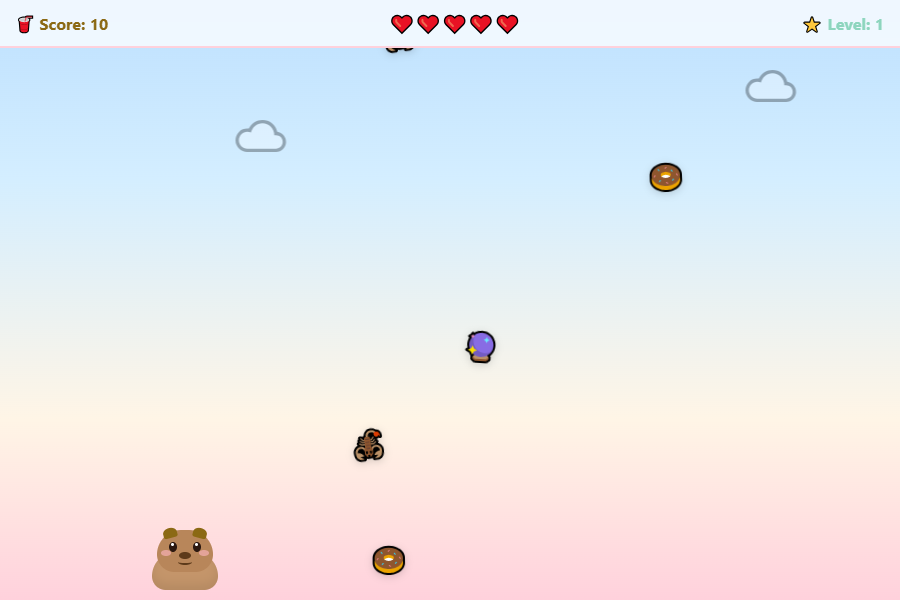
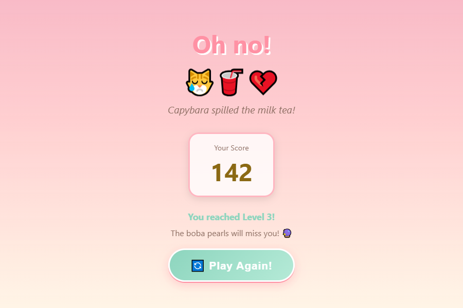

<div align="center">

# 🥤 Capybara Bubble Tea Catcher

### _Help the cutest capybara catch delicious bubble tea treats!_

[](https://j2teamnhqk.github.io/capybara-bubble-tea-catcher/)
[](#)
[](#)
[](#)
[](#)

</div>

---

## 🎮 Live Demo

**👉 [Play the game here!](https://j2teamnhqk.github.io/capybara-bubble-tea-catcher/)**

---

## 📸 Screenshots

<div align="center">

### Start Screen



### Gameplay



### Game Over



</div>

---

## 🌸 About

**Capybara Bubble Tea Catcher** is a cute, kawaii-themed casual web game where you control an adorable capybara to catch falling bubble tea treats while avoiding dangerous items.

Built entirely with **vanilla HTML, CSS, and JavaScript** — no frameworks, no libraries, no external assets. Everything runs directly in the browser from local files.

### ✨ Highlights

- 🎨 Pastel pink, mint, cream & sky-blue color palette
- 🐻 Capybara character drawn entirely with CSS
- 🎵 Sound effects using Web Audio API
- 📱 Works on both desktop and mobile
- ⚡ Smooth 60fps game loop with `requestAnimationFrame`

---

## 🕹️ How to Play

| Action     | Desktop          | Mobile                               |
| ---------- | ---------------- | ------------------------------------ |
| Move Left  | `←` Arrow or `A` | Tap left side of screen / ⬅️ button  |
| Move Right | `→` Arrow or `D` | Tap right side of screen / ➡️ button |

### Good Items (Catch them! ✅)

| Item          | Points |
| ------------- | ------ |
| 🥤 Bubble Tea | +15    |
| 🔮 Boba Pearl | +10    |
| ❤️ Heart      | +8     |
| 🍓 Strawberry | +12    |
| 🍰 Cake       | +10    |
| 🍮 Pudding    | +10    |
| 🍡 Dango      | +12    |
| 🌸 Sakura     | +5     |
| 🍪 Cookie     | +8     |
| 🍩 Donut      | +10    |

### Bad Items (Avoid! ❌)

| Item           | Damage |
| -------------- | ------ |
| 🌶️ Hot Pepper  | -1 ❤️  |
| 💣 Bomb        | -1 ❤️  |
| ⛈️ Storm Cloud | -1 ❤️  |
| 🍋 Sour Lemon  | -1 ❤️  |
| 💀 Skull       | -2 ❤️  |
| 🦂 Scorpion    | -1 ❤️  |
| 👻 Ghost       | -1 ❤️  |

---

## ⚙️ Features

- ✅ **Score system** — earn points by catching good items
- ✅ **Lives system** — 5 hearts; lose them all and it's game over
- ✅ **Level progression** — difficulty increases every 50 points (faster items, more frequent spawns)
- ✅ **Start screen** — with title, capybara preview, and instructions
- ✅ **Game over screen** — final score, level reached, cute message, and restart button
- ✅ **Visual effects** — particles, floating score text, screen flash, shake/bounce animations
- ✅ **Sound effects** — catch, hurt, level-up, and game over sounds via Web Audio API
- ✅ **Mobile support** — touch controls + on-screen buttons
- ✅ **Responsive design** — adapts to different screen sizes
- ✅ **Pure CSS character** — capybara with blinking eyes, blush cheeks, and ears
- ✅ **Clean restart** — full state reset with no lingering bugs

---

## 🛠️ Tech Stack

| Technology            | Usage                                                    |
| --------------------- | -------------------------------------------------------- |
| **HTML5**             | Game structure, screens, HUD                             |
| **CSS3**              | Styling, animations, character design, responsive layout |
| **JavaScript (ES6+)** | Game logic, input handling, collision detection, audio   |
| **Web Audio API**     | Lightweight sound effects                                |
| **GitHub Pages**      | Deployment & hosting                                     |

No frameworks. No libraries. No build tools. Just pure web technologies.

---

## 🚀 Run Locally

```bash
# Clone the repository
git clone https://github.com/J2TEAMNHQK/capybara-bubble-tea-catcher.git

# Open the game
cd capybara-bubble-tea-catcher
# Simply open index.html in your browser
start index.html        # Windows
open index.html         # macOS
xdg-open index.html     # Linux
```

Or use a local development server:

```bash
# Using Python
python -m http.server 8000

# Using Node.js (npx)
npx serve .
```

Then visit `http://localhost:8000` in your browser.

---

## 📁 Project Structure

```
capybara-bubble-tea-catcher/
├── index.html                    # Main HTML structure (3 screens)
├── style.css                     # All styles, animations & responsive design
├── script.js                     # Game logic, input, collision, audio
├── README.md                     # This file
└── assets/
    └── screenshots/
        ├── start.png             # Start screen screenshot
        ├── gameplay.png          # Gameplay screenshot
        └── gameover.png          # Game over screen screenshot
```

---

## 🏗️ Architecture

The JavaScript code is organized into clear sections:

| Module                  | Responsibility                                      |
| ----------------------- | --------------------------------------------------- |
| **Constants & Config**  | Game settings, item definitions, messages           |
| **Game State**          | Central state object with score, lives, items, etc. |
| **Audio System**        | Web Audio API wrapper for sound effects             |
| **Screen Management**   | Show/hide start, game, and game over screens        |
| **Input Handling**      | Keyboard (arrow/WASD) + touch + mobile buttons      |
| **Item Spawning**       | Random item generation with good/bad ratios         |
| **Collision Detection** | AABB collision between capybara and items           |
| **Visual Effects**      | Particles, floating text, screen flash              |
| **Difficulty Scaling**  | Progressive speed & spawn rate increase             |
| **Game Loop**           | `requestAnimationFrame`-based main loop             |

---

## 🔮 Future Improvements

- 🔊 **Sound toggle** — mute/unmute button for audio
- 🏆 **Leaderboard** — save high scores to `localStorage`
- 🎯 **Combo system** — bonus multiplier for consecutive catches
- 🛡️ **Power-ups** — shield, magnet, slow-motion items
- 🎨 **Skins** — unlockable capybara outfits
- 🌍 **More levels** — themed backgrounds (beach, space, sakura park)
- ⏸️ **Pause button** — pause/resume during gameplay
- 🎵 **Background music** — looping cute melody
- 📊 **Statistics** — track games played, total items caught
- 🤝 **Share scores** — social media sharing button

---

## 👤 Credits

This project was built by an **AI agent** (Claude) following detailed requirements from the user. The entire game — HTML structure, CSS styling, JavaScript logic, character design, and game mechanics — was generated and refined through an iterative development process.

- **Design**: Pastel kawaii aesthetic inspired by bubble tea culture
- **Character**: CSS-only capybara with animated features
- **Audio**: Procedurally generated using Web Audio API

---

<div align="center">

Made with 💖 and 🥤 by AI

_If you enjoyed this game, give it a ⭐!_

</div>
